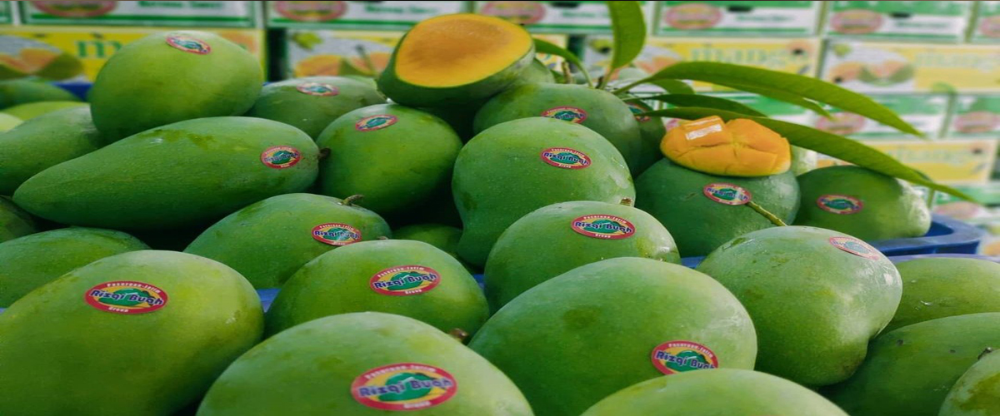
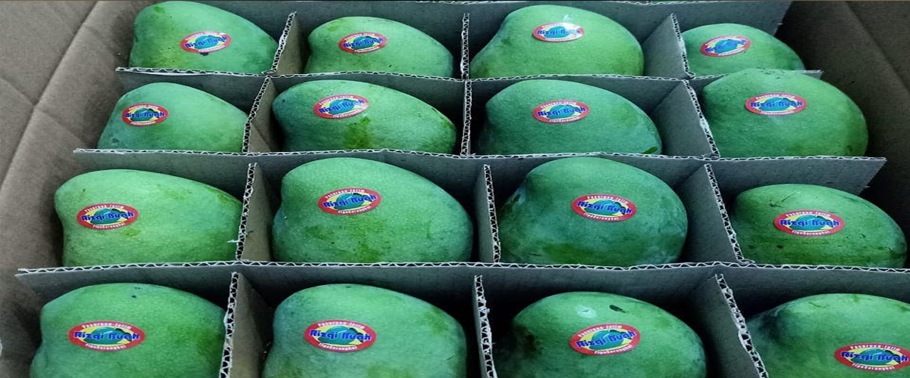
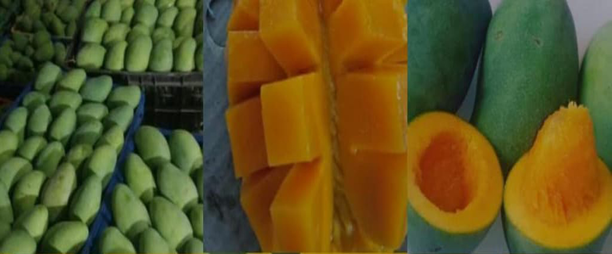
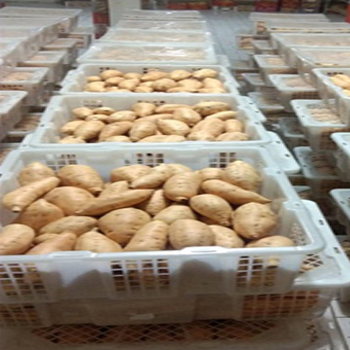

<html lang="en">
  <head>
    <!-- Required meta tags -->
    <meta charset="utf-8" />
    <meta name="viewport" content="width=device-width, initial-scale=1" />

    <!-- Bootstrap CSS -->
    <link href="https://cdn.jsdelivr.net/npm/bootstrap@5.0.2/dist/css/bootstrap.min.css" rel="stylesheet" integrity="sha384-EVSTQN3/azprG1Anm3QDgpJLIm9Nao0Yz1ztcQTwFspd3yD65VohhpuuCOmLASjC" crossorigin="anonymous" />

    <!-- bootstrap icon -->
<link rel="stylesheet" href="https://cdn.jsdelivr.net/npm/bootstrap-icons@1.7.2/font/bootstrap-icons.css">
<!-- font -->
<link rel="preconnect" href="https://fonts.googleapis.com">
<link rel="preconnect" href="https://fonts.gstatic.com" crossorigin>
<link href="https://fonts.googleapis.com/css2?family=Merriweather+Sans:ital@1&display=swap" rel="stylesheet">
<link rel="stylesheet" href="fontawesome/fontawesome-free-6.0.0-beta3-web/css/all.min.css">

<!-- my css -->
    <link rel="stylesheet" href="style.css">
    <link rel="icon" href="img/projects/logo.jpeg" type="image/x-icon">
    <title>Agro Indo Jaya</title> 
  
  #products {
  background-color: #73cef1;
}

h1 {
  text-align: center;
}

#collapse {
  font-family: "Merriweather Sans", sans-serif;
}

.section {
  padding-top: 6rem;
}

.carousel-item {
  height: 500px;
  width: 1200px;
}

.nama-tim {
  font-size: 20px;
}

.new-tim {
  background-color: #73cef1;
}

.nav-item :hover {
  transform: scale(1.2);
  transition: 0, 2s;
}

.img-title {
  position: absolute;
  width: 100%;
  height: 100%;
  background-image: linear-gradient(to bottom, rgba(5, 5, 5, 0), rgba(5, 5, 5, 1));
  top: 400px;
  transition: all 0.2s ease-in;
}

.img-title p,
h3 {
  text-align: center;
  color: rgb(255, 255, 255);
  line-height: 20px;
  position: relative;
  top: 100px;
  text-shadow: rgba(5, 5, 5, 0.5);
}

.card:hover .img-title {
  top: 0;
  transition: all 0.2s ease-out;
}

.container1 {
  width: 1056px;
  height: 980px;
  background-color: #73cef1;
  margin: auto;
  display: flex;
  flex-wrap: wrap;
}

.card {
  display: flex;
  position: relative;
  overflow: hidden;
  border: 10px;
}

.card img {
  transform: scale(1);
  transition: all 0.3s ease-out;
}

.card:hover img {
  transform: scale(1.1);
  transition: all 0.3s ease-in;
}

@media screen and (max-width: 1056px) {
  .container1 {
    width: 100%;
    height: 100%;
  }
  .card {
    width: 30%;
    height: 15%;
  }

  .img-title {
    position: absolute;
  }
  .img-title p,
  h3 {
    top: 10px;
    font-size: 8pt;
    line-height: 10px;
  }
}
  
  </head>
  <!-- header -->
    

      

        <h1>AGRO INDO JAYA</h1>
      

    

  <!-- akhir header -->

  <body id="home">
    <!-- Navbar -->
    <nav class="navbar navbar-expand-lg navbar-dark shadow-sm Text-bold" style="background-color:#566ef8">
      

        

        <button class="navbar-toggler" type="button" data-bs-toggle="collapse" data-bs-target="#navbarNav" aria-controls="navbarNav" aria-expanded="false" aria-label="Toggle navigation">
          
        </button>

        

          <ul class="navbar-nav ms-auto">
            <li class="nav-item">
              <a class="nav-link active" aria-current="page" href="#home">Home</a>
            </li>
            <li class="nav-item">
              <a class="nav-link" href="#about">About Us</a>
            </li>
            <li class="nav-item">
              <a class="nav-link" href="#contact">Contact</a>
            </li>
            <li class="nav-item">
              <a class="nav-link" href="#products">Our products</a>
            </li>
          </ul>
        

      

    </nav>
    <!-- Akhir Navbar -->

    <!-- carousel -->
    

    

  

    <button type="button" data-bs-target="#carouselExampleIndicators" data-bs-slide-to="0" class="active" aria-current="true" aria-label="Slide 1"></button>
    <button type="button" data-bs-target="#carouselExampleIndicators" data-bs-slide-to="1" aria-label="Slide 2"></button>
    <button type="button" data-bs-target="#carouselExampleIndicators" data-bs-slide-to="2" aria-label="Slide 3"></button>
    <button type="button" data-bs-target="#carouselExampleIndicators" data-bs-slide-to="3" aria-label="Slide 4"></button>
  

  

    

      
    

    

      
    

    

      
    

    

      
    

  

  <button class="carousel-control-prev" type="button" data-bs-target="#carouselExampleIndicators" data-bs-slide="prev">
    
    Previous
  </button>
  <button class="carousel-control-next" type="button" data-bs-target="#carouselExampleIndicators" data-bs-slide="next">
    
    Next
  </button>

    <!-- akhir carousel -->
    <!-- about -->
    <section id="about">
        

            

                

                <h1>About Us</h1>
                

            

            

                

                  Since 2017 our company has collaborated with registered local farmers to produce fresh fruit and market it to local and modern markets.   our company is starting to expand to provide our products to the international market
                

            

            

              

                  <i class="bi bi-gem fs-1"></i>
                 <h2>Our Quality</h2>
                
our company is committed to serve customers with the best possible to get the best products. our team directly supervises the production system, grading system, and packing strictly

              

            

            

              

                  <i class="fas fa-handshake fs-1"></i>
                 <h2>Commitment and Integrity</h2>
                
Integrity means doing business honestly, speaking the truth, treating our partner with good services and respectfully.  
                  we are committed to have a positive impact on farmers as our suppliers to be more prosperous

              

            

            

              

                  <i class="bi bi-box-seam fs-1"></i>
                 <h2>Production and Packaging</h2>
                
In our production warehouse, we work with experienced team and keep learning with new technology.  
                  our packaging uses various types of packaging according to the market needed (Cardboard, Wood, Plastic, Europool, Esteco)

              

            

        

        <svg xmlns="http://www.w3.org/2000/svg" viewBox="0 0 1440 320"><path fill="#73cef1" fill-opacity="1" d="M0,256L48,240C96,224,192,192,288,170.7C384,149,480,139,576,165.3C672,192,768,256,864,240C960,224,1056,128,1152,122.7C1248,117,1344,203,1392,245.3L1440,288L1440,320L1392,320C1344,320,1248,320,1152,320C1056,320,960,320,864,320C768,320,672,320,576,320C480,320,384,320,288,320C192,320,96,320,48,320L0,320Z"></path></svg>
    </section>
    <!-- akhir about -->

    <!-- Product -->
    <section id="products">
        

            

                

                    <h1>Our Product</h1>
                

            

        

            

                    

                        
                          

                            <h3>Mango</h3>
                            
Harum Manis Mango  
                            Harvest time : June-December  
                          weight avg 400 gram up   color : green   Maturity : 80%   Packing with cardboard box 12 pcs 5 kg 

                          

                    
    
                
                    

                        
                        

                          <h3>Dragonfruit</h3>
                          
 Harvest time : September-March   Size : 3/4 fruits/kg   Red or white flesh of fruits   Fin : green leaves
                            Maturity : 70%   Color : pink to red well covered 

                          

                    

                    

                      
                        

                          <h3>Mangosteen</h3>
                          
 Harvest time : November-March   Size : 8-10 fruits/kg  
                          Maturity : 80%   Color : pink/light purple with 4 green ear 

                    

                  

                    

                        
                        

                          <h3>Salacca (snakefruits)</h3>
                          
 Harvest time : November-July   Size : 10-14 fruits /kg   free from thom (no spike)   Maturity : 70%   color : shiny black brown 

                          

                    

                  

                      
                        

                          <h3>Kefir lime</h3>
                          
 Harvest every mounth   Size : 15-20 fruits/kg  
                          Maturity : ripe well   color : Dark green 

                          

                  

                  

                    
                    

                      <h3>Pineaple</h3>
                      
 Harvest time : August-October   Size : 800 gram   Maturity : 75%   color : yellow to green 

                      

                

                

                  
                    

                    <h3>Ginger</h3>
                    
 Fresh or dried   sun dried proccess   Moisture : 10%   color : red or white  Approved as organic farm 

                    

                

                    
                    

                      
                        

                        <h3>Sweet Potato</h3>
                        
 Harvest every mounth   Size : 15-20 fruits/kg   Maturity : ripe well   color : Dark green 

                        

                    

                    

                      
                        

                        <h3>Galangal</h3>
                        
 Fresh or dried   sun dried proccess   Moisture : 15%   Approved as organic farm 

                        

                    

            

          </section>
    <!-- akhir products -->

    <!-- Contact -->
    <svg xmlns="http://www.w3.org/2000/svg" viewBox="0 0 1440 320"><path fill="#73cef1" fill-opacity="1" d="M0,160L48,170.7C96,181,192,203,288,213.3C384,224,480,224,576,218.7C672,213,768,203,864,186.7C960,171,1056,149,1152,144C1248,139,1344,149,1392,154.7L1440,160L1440,0L1392,0C1344,0,1248,0,1152,0C1056,0,960,0,864,0C768,0,672,0,576,0C480,0,384,0,288,0C192,0,96,0,48,0L0,0Z"></path></svg>
    <section id="contact">
        

            

                

                    <h1>Contact Us</h1>
                

            

            

                

                  

                    <strong>Thank you!</strong> your message has been send.
                    <button type="button" class="btn-close" data-bs-dismiss="alert" aria-label="Close"></button>
                  

                    <form name="submit-to-google-sheet"> 
                      

                        <label for="name" class="form-label">Full Name</label>
                        <input type="Text" class="form-control" id="exampleInputEmail1" aria-describedby="name" name="nama">
                         
                      

                      

                        <label for="email" class="form-label">Email Address</label>
                        <input type="email" class="form-control" id="exampleInputEmail1" aria-describedby="email" name="email">
                          
                      

                      

                        <label for="pesan" class="form-label">Message</label>
                        <textarea class="form-control" id="Pesan" rows="3" name="pesan"></textarea>
                      
  
                        <button type="submit" class="btn btn-primary btn-kirim">Submit</button>
                        <button class="btn btn-primary btn-loading d-none" type="button" disabled>
                          
                          Loading...
                        </button>
                      </form>
                      

                

          

            <svg xmlns="http://www.w3.org/2000/svg" viewBox="0 0 1440 320"><path fill="#73cef1" fill-opacity="1" d="M0,128L48,149.3C96,171,192,213,288,229.3C384,245,480,235,576,218.7C672,203,768,181,864,176C960,171,1056,181,1152,192C1248,203,1344,213,1392,218.7L1440,224L1440,320L1392,320C1344,320,1248,320,1152,320C1056,320,960,320,864,320C768,320,672,320,576,320C480,320,384,320,288,320C192,320,96,320,48,320L0,320Z"></path></svg>
    </section>
    <!-- akhir contact -->
  <!-- Team -->
  

    

      

          <h1>Our Team</h1>
        

          
          <h1 class="nama-tim">Irawan Wicaksono S,P</h1>
          
Sales Marketing

        

        

          
          <h1 class="nama-tim">Dany Setyawan S,E</h1>
          
Manager

        

        

          
          <h1 class="nama-tim">Ridlo Imagine S,T</h1>
          
Front end Developer

        

      

    

  

  
  <!-- akhir Team -->

  <!-- Partner -->
  <svg xmlns="http://www.w3.org/2000/svg" viewBox="0 0 1440 320"><path fill="#73cef1" fill-opacity="1" d="M0,256L48,229.3C96,203,192,149,288,133.3C384,117,480,139,576,176C672,213,768,267,864,256C960,245,1056,171,1152,160C1248,149,1344,203,1392,229.3L1440,256L1440,0L1392,0C1344,0,1248,0,1152,0C1056,0,960,0,864,0C768,0,672,0,576,0C480,0,384,0,288,0C192,0,96,0,48,0L0,0Z"></path></svg>
  

    

        

          <h1 class="mb-3">Our Partner</h1>
            

              
            

        

    

  

  <!-- Akhir partner -->

  <!-- medsos -->
  

    
  
    

      

        <H1 class="text-center fs-4 text-white">PT Agro Indo Jaya</H1>  
        
Jl. Perumahan Sukodono Permai  
        Telp. (0334) 882228
 
        

          <a href="https://www.instagram.com/ptagroindonusantara/"><i class="bi bi-instagram"></i></a>
          <a href="#"><i class="bi bi-facebook"></i></a>
          <a href="https://www.linkedin.com/in/irawan-wicaksono-a988b1228/"><i class="bi bi-linkedin"></i></a>
          <a href="https://wa.me/6281232205878/?text=Hi Agro Indo Jaya, i want to ask question and get more information from your company's products"><i class="bi bi-whatsapp"></i></a>
        

      

    

  

  <!-- Akhir medsos -->

    <!-- footer -->
    

      <footer>&copy; 2021 Agro Indo Jaya. All right reserved
    

    <!-- akhir footer -->

    
    
  </body>
</html>
